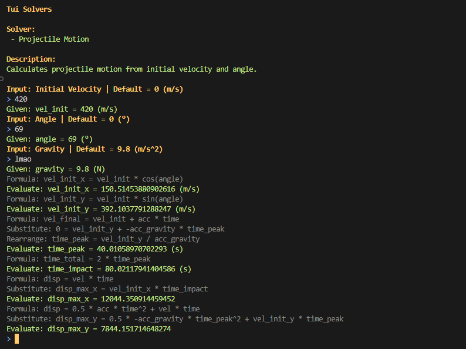

# Physics Calculator

## About

A CLI-based physics calculator created by DmmD GM using TypeScript.

## Prerequisite

-   Node.js (LTS Recommended)

## Installation

1. Download the repository by either using git:

```bash
git clone https://github.com/DmmDGM/physics-calc
cd physics-calc
```

Or by clicking on the "Download Zip" button on the top right of the GitHub repository and unzipping the zip file.

2. Run the following command to install the necessary packages:

Windows:

```bash
./scripts/install.ps1
```

Linux / MacOS:

```bash
./scripts/install.sh
```

3. Run the following command to run the program:

Windows:

```bash
./scripts/run.ps1
```

Linux / MacOS:

```bash
./scripts/run.ps1
```

## Usage

-   Follow the instructions to navigate through the program.
-   Press `ctrl + c` at any time to exit the program.

## Screenshots


